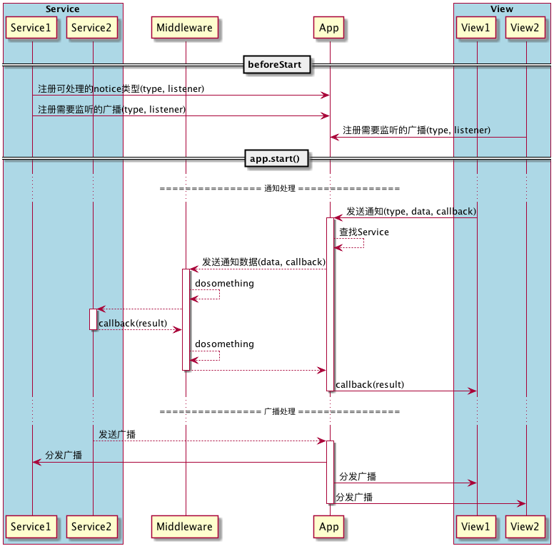

# WEB前端框架设计

--
# 基础概念
### Notice（通知）

Notice 是 View 层组件及 Service 实例产生的定向事件，可以理解为对用户操作行为或定时任务等后台行为的抽象。Notice 统一由 Service 及其子类实例进行处理，且同一类型 Notice 只能被一个 Service 实例监听并处理，以此保证 Service 功能的唯一性和功能内聚性

Notice 实例除可携带 Service 功能所需的数据，还可以携带一个回调函数，用于将回调结果直接反馈给 Notice 的发起对象，以此来降低代码复杂度

### Broadcast（广播）

Broadcast 是对非定向消息的抽象，Broadcast 只能由 Service 派发。同一类型的 Broadcast 可被多个 View 组件与 Service 共同监听。监听者通过监听广播事件来进行各自的业务逻辑

### View（视图层）

视图层即视图组件所组成的前端组件树，组件通过 Notice 抽象玩家对视图组件的操作，通过接收 Notice 的处理回调结果和 Service 派发的 Broadcast 来重新定义组件状态

通过使用 Notice 和 Broadcast，View 层与其他非视图层业务逻辑得以解耦，因此视图层的视图组件不再仅限于 Vue 组件，还可以是 React 组件、Angular 组件甚至真实的 DOM 元素

### Service（服务）

Service 是所有业务的处理单元，将不同的模块功能封装为不同的 Service 实例，可使得每个模块的功能内聚；与此同时，所有 Service 之间通过 Notice 进行消息传递，从而使不同的Service之间的功能解耦

### App 

App 实例是所有消息的集散地，同时也是应用逻辑的入口及调用根节点

* App 实例是所有 Notice 与 Broadcast 的传递通道
* App 实例内部维护所有已注册的 Service 实例，登记每个 Service 可以处理的 Notice 类型，保证每个类型的消息只能由唯一的 Service 处理。
* App 实例内部维护所有的已注册的 Broadcast 监听器，当接收到 Broadcast 时，依次向监听器分发处理

### Middleware（中间件）

中间件用来定义对 Notice 消息进行过滤、记录等可拓展的操作。

App 在将 Notice 传递给 Service 之前会先传递给中间件，并在获取到 Service 的处理结果回调时先将结果发送给中间件，之后再发送给 Notice 发起者。

中间件可选择性地切入 Notice 处理前后的两个阶段，但无法 Notice 本身或回调结果做出修改

### 示例图

--

# ViewPlugin

视图层拓展，根据视图层框架不同定义不同的Plugin，以使 View 层组件具备接收 Broadcost 和发送 Notice 的功能

视图层根据自身所用的框架，选择不同的Plugin进行集成

--

# 类图示例

